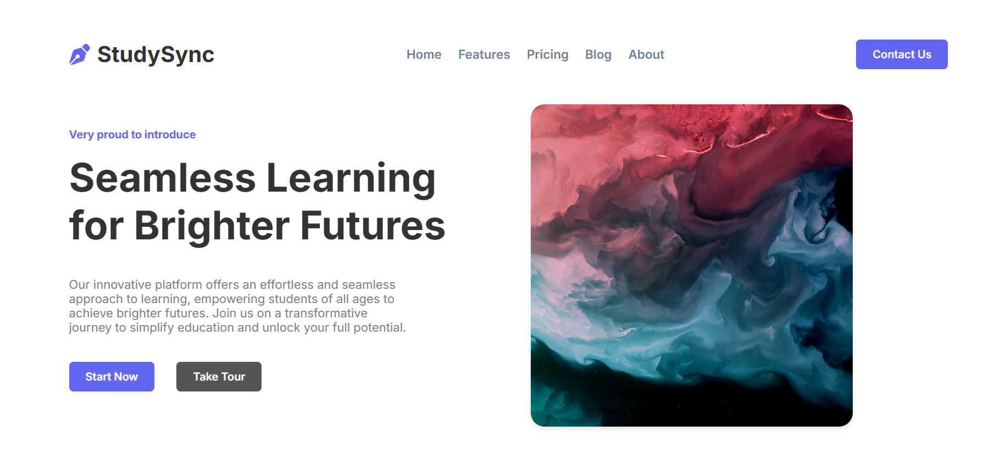

# 📘 StudySync  

A simple yet effective project built using **HTML and CSS**, designed to sharpen my frontend development skills.  

🔗 **Live Demo**: [Click here to visit the site](https://projectstudysync.vercel.app/)  

---

## 📸 Preview  

  

---

## ✨ Features & Concepts Covered  

- ✍️ **Typography** → fonts, line-height, text alignment  
- 🎞️ **Animations & Transitions**  
- 📱 **Media Queries** → responsive design for multiple screen sizes  
- 🎨 **Colors, Gradients, and Backgrounds**  
- 📦 **Box Model** → margin, padding, border  
- 🔲 **Flexbox & Grid Layouts**  
- 🧱 **HTML5 Semantic Tags** → `<header>`, `<nav>`, `<main>`, `<footer>`  

---

## 🌐 Responsiveness  

The site is fully responsive and adjusts smoothly across different screen sizes, ensuring a great user experience on both **desktop 💻** and **mobile 📱**.  

---

## 📂 File Structure  

StudySync/  
│── index.html # Main HTML file  
│── style.css # Stylesheet  
│── screenshot.png # Project preview image  
└── images/ # All image resources  

---

## 🚀 Learning Outcome  

This project helped me:  
- Practice **structuring content** with semantic HTML  
- Improve **layout styling** using CSS  
- Understand **responsive behavior** in real-world scenarios  

---

## 📜 License  

Free to use and learn ✨  
