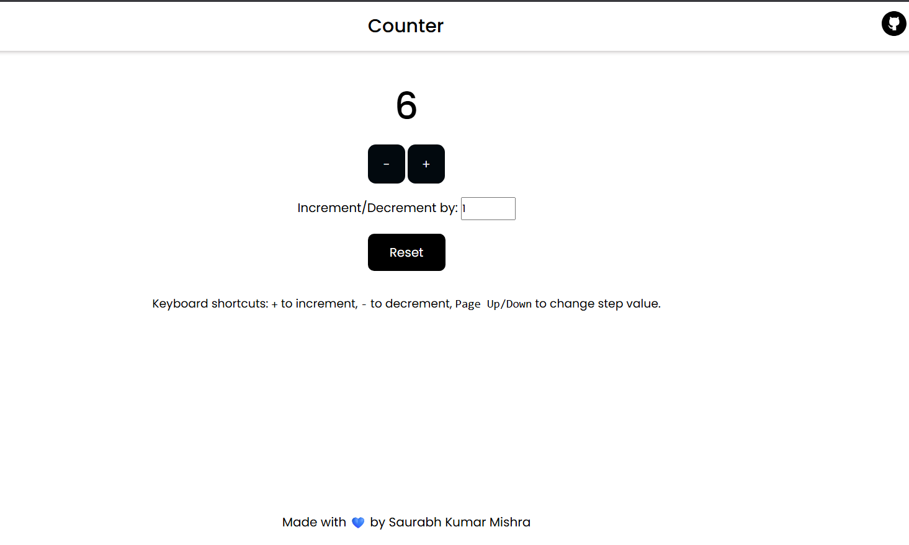

# Counter Project  

🔗 **Live Demo**: [Click Here to View Project](https://your-username.github.io/counter-project/)  

A simple **JavaScript mini project** built with **HTML, CSS, and JavaScript**.  
This counter application allows users to increment or decrement a value using `+` and `-` buttons. Additionally, it supports a **step value input**, so the counter increases or decreases by the specified step value instead of just `1`.  

It also includes keyboard functionality:  
- Press **PageUp** → increases the step value by `1`.  
- Press **PageDown** → decreases the step value by `1` (with a minimum of `1`).  
- A **Reset button** sets the counter value back to `0`.  

---

## 🚀 Features  

- **Increment & Decrement** the counter using `+` and `-` buttons.  
- **Custom Step Value**: Enter a number (minimum value: `1`) to change the increment/decrement step size.  
- **Keyboard Shortcuts**:  
  - `PageUp` → Increase step value by `1`.  
  - `PageDown` → Decrease step value by `1`.  
- **Reset Button**: Instantly reset the counter back to `0`.  
- **Dynamic Updates**: Counter updates instantly based on the current step value.  
- **Simple & Responsive UI** with HTML and CSS.  

---

## 🛠️ Technologies Used  

- **HTML5** – structure of the app  
- **CSS3** – styling and layout  
- **JavaScript (ES6)** – functionality and logic  

---
## 📸 Preview  

---

counter-project/
├── index.html # Main HTML file
├── style.css # Styling for the app
├── script.js # Counter functionality
└── README.md # Project documentation

---

## ⚙️ How It Works  

1. Open the project in your browser.  
2. Use the **step value input** to set the number you want to increase or decrease by (default: `1`).  
3. Click on the **+** button to increase the counter.  
4. Click on the **-** button to decrease the counter.  
5. Press **PageUp** to increase the step value by `1`.  
6. Press **PageDown** to decrease the step value by `1` (cannot go below `1`).  
7. Click **Reset** to reset the counter back to `0`.  

---

## 💡 Example  

- Counter starts at `0`.  
- Step value = `5`.  
- Clicking `+` → counter = `5`.  
- Clicking `-` → counter = `0`.  
- Pressing `PageUp` → step value = `6`.  
- Pressing `PageDown` → step value = `5`.  
- Clicking **Reset** → counter = `0`.  

---

## 📜 License  

This project is free to use and open source.  

## 📂 Project Structure  

