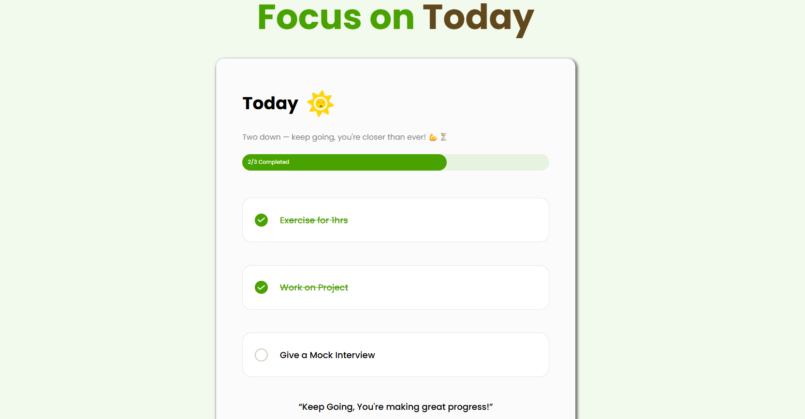

# 🌟 Focus on Today Project  

🔗 **Live Demo**: [Click Here to Visit the Project](https://focusontodayproject.vercel.app/)  

**Focus on Today** is a fully functional web project built using **HTML, CSS, and JavaScript**.  
It helps users stay focused and productive by managing their **daily tasks** in a simple and effective way.  

---

## 📌 Key Features  

- ➕ **Add up to three daily tasks** to keep your to-do list simple and focused.  
- 🗹 **Mark tasks as complete** using a check button for each.  
- 📊 **Dynamic progress bar** updates in real-time based on tasks completed.  
- 🖥️📱 **Responsive design** – works smoothly on phones, tablets, and desktops.  
- 🎨 **Clean and user-friendly UI** for a pleasant user experience.  
- 💾 **Local Storage Support** – tasks are saved and remain even after refreshing the page.  
- ⚡ **JavaScript Concepts Used**: Event Listeners, DOM Manipulation, Local Storage.  

---

## 🛠️ Technologies Used  

- **HTML5** – structure of the app  
- **CSS3** – styling and layout  
- **JavaScript (ES6)** – functionality and logic  

---

## 📸 Preview  

  

---

## 📂 Project Structure  

Focus_on_Today_project/  
├── index.html # Main HTML file  
├── style.css # Styling for the app  
├── script.js # Task manager functionality  
├── images/ # Folder containing all image sources (icons, screenshots, etc.)  
│ └── screenshot.png # Project screenshot  
├── README.md # Project documentation  

---

## ⚙️ How It Works  

1. Open the project in your browser.  
2. Add up to **three daily tasks** in the input fields.  
3. Use the **check button** to mark tasks as completed.  
4. Watch the **progress bar update** dynamically as tasks are completed.  
5. Refresh the page – your tasks will still be there, thanks to **local storage**.  

---

## 💡 Example Workflow  

- Add Task 1, Task 2, Task 3.  
- Mark Task 1 complete → progress bar = 33%.  
- Mark Task 2 complete → progress bar = 66%.  
- Mark Task 3 complete → progress bar = 100%.  
- Refresh page → tasks remain saved.  

---

## 📜 License  

This project is free to use and open source.  

---
